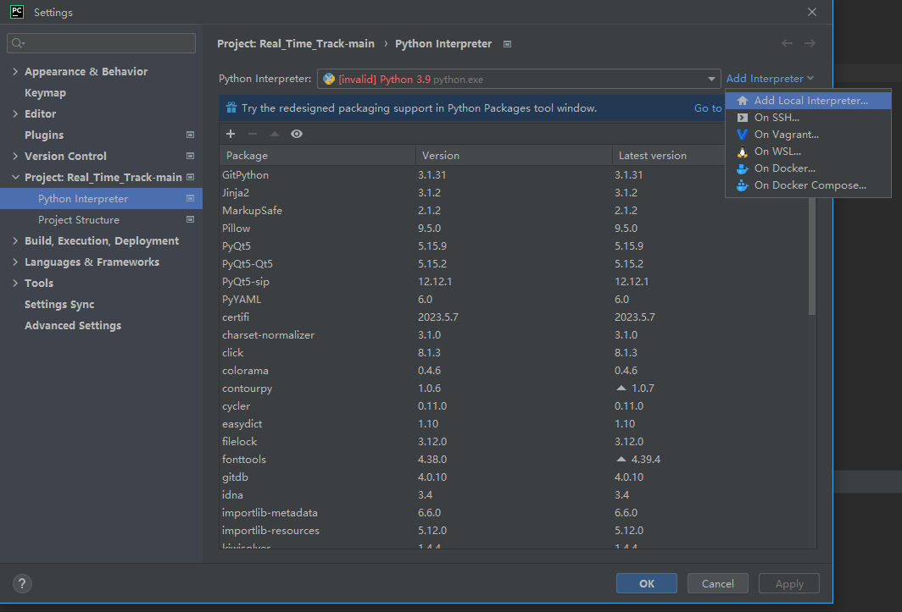
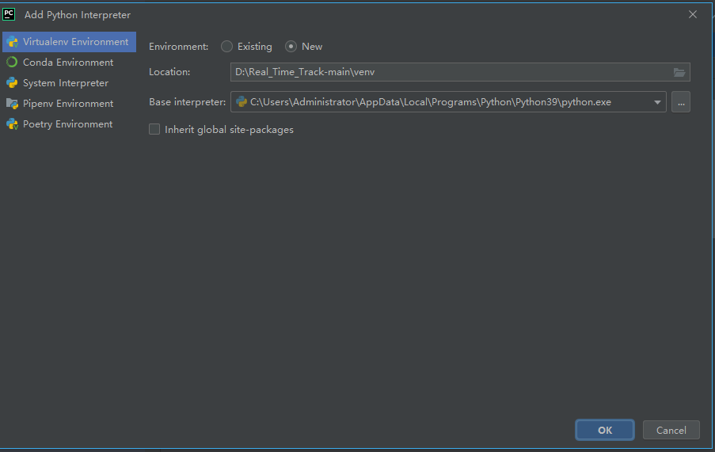

# Auckland University of Technology

## Research and Development

### Real-time Traffic Video Generator

#### Primary used Skills
`OpenCv` `matplotlib` `PyQt5` `Yolov5` `Deep_Sort`

# Purpose of this project🧐

> This program provides a PyQt-based interface that uses YOLOv5 and DeepSort for object detection and tracking in videos.

> When the program is executed, the user can select a video file. The selected video is then processed using the YOLOv5 model to detect objects, and the detected objects are tracked using the DeepSort algorithm. Tracked objects are assigned unique identifiers (IDs), and their trajectories are visually displayed.

>The interface includes "Play," "Pause," and "Replay" buttons. Clicking the "Play" button starts the object detection and tracking. The "Pause" button allows pausing the detection and tracking process, and the "Replay" button restarts the detection and tracking from the beginning.

>A dropdown list is provided for selecting the model, allowing the user to choose from various pretrained YOLOv5 models. The selected model is used for real-time object detection and tracking.

>This program provides a user-friendly environment for visualizing object detection and tracking, making it useful for tasks in video processing and computer vision.

# 🛠️ Usage

- [Setup](#setup)
- [Summary](#Summary)
- [Analysis](#Analysis)

## Setup

Step 1️⃣ Clone our repository to your local machine.
 

    git clone https://github.com/autJiahao/Real_Time_Track.git  # clone

Step 2️⃣ Navigate to the downloaded folder and change directory to our file. 
 

    cd Real_Time_Track-main

Step️ 3️⃣ Create a virtual environment.（We suggest you are using python 3.9）
 
go to setting, click project:Real_Time_Track-main,then click Python Interpreter, add interpreter, Add Local interpreter
 

 
Environment: new 
Location: path\to\the\project\venv 
Base interpreter: choose 

Step️  4️⃣
 Activate the virtual environment.
 

    venv\Scripts\activate

Step️  5️⃣ Install the dependencies listed in the requirement.txt file.
 
    
    pip install -r requirements.txt  # install
 
step 6️⃣
 Start main.py in a virtual environment

 
    
    python main.py

 
## Summary

 

 

1. Import Statements:
    - Importing required modules and classes from different Python files and libraries. 
    

2. Yolov5 Thread Class:
    - A custom QThread subclass that runs YOLOv5 object detection on input frames.
    - The run method performs the main detection and annotation logic.
    - The send_img signal is emitted to send the annotated frames to the GUI.
     

3. Deepsort Thread class:
    - Another custom QThread subclass that runs DeepSort object tracking on the detected objects from YOLOv5.
    - The run method performs the tracking and annotation logic.
    - The send_img2 signal is emitted to send the annotated frames to the GUI.
     

4. Window Class:
    - Inherits from QWidget and represents the main application window.
    - Sets up the GUI elements, such as buttons, labels, and file dialogs.
    - Handles button clicks and connects them to appropriate actions.
    - Initializes instances of Yolov5Thread and DeepsortThread classes.
    - Contains methods for displaying images in the GUI labels.
     

5. Main Execution:
    - Initializes the QApplication and creates an instance of the Window class.
    - Shows the window and starts the application event loop.
     

## Analysis

📈 **This code creates a thread to run the YOLOv5 object detection model using Python. YOLOv5 is one of the deep learning models used for object detection in the field of computer vision.**

----
 - Yolov5 QThread
----
  

> 🔎 **__init__**: In the initialization function, we set up the weights for the YOLOv5 's' model, the input source, the IOU threshold, and so on. This function is called only once when the thread is created.
 

> 🔎 **run**: This method is called when the thread starts, and the actual object detection operation is performed here. First, it loads the YOLOv5 model, processes the input image, and performs object detection using the model. Then, it uses the Annotator object to display information about the detected objects on the screen. Finally, it sends the processing results for each image via the send_img signal.
 

> 🔎 **attempt_load, check_img_size, non_max_suppression, scale_coords, Annotator, etc.**, are functions or classes provided by the YOLOv5 library. They are responsible for tasks such as model loading, image size checking, non-max suppression, coordinate adjustment, and adding annotations to the result.
>  

----
- DeepSort QThread
----
 

> 🔎 **run**: This function is called when the thread starts, and the actual object detection and tracking work is performed here. It initializes DeepSORT and loads the YOLOv5 model. It then processes the input images and uses the model to detect objects, and then uses DeepSORT to track the detected objects. This operation is performed for all images in the input dataset, and tracking information is updated using the location information of the objects detected in the previous frame and the location information of the objects detected in the current frame. The tracked object's movement paths are stored in trajectories and this information is drawn as a line on the image.
 

> 🔎 **Trajectory**: The code utilizes the object tracking results to draw the trajectory of each object. By connecting the previous and current positions with lines, it visualizes the movement path of the objects. The trajectory drawing is achieved using the cv2.line function from OpenCV.
 

> 🔎 Functions or classes like **get_config, DeepSort, select_device, attempt_load, check_img_size, non_max_suppression, scale_coords, Annotator, xyxy2xywh, etc.**, are provided by the YOLOv5 or DeepSORT libraries. They are responsible for tasks such as model loading, image size checking, non-max suppression, coordinate adjustment, adding annotations to results, bbox conversion, etc.
 

----
- Window (QWidget)
----
 

> 🔎 **open_file**: This function is called when the 'Select Video' button is pressed, allowing the user to select a video file.
 

> 🔎 **change_model**: This function is called when the user selects a different item in the combo box, changing the model.
 

> 🔎 **show_image, show_image2**: These functions receive the image processing results from the threads and display them in the GUI. show_image(object detection) receives the result from the YOLOv5 thread and displays it on the left label, while show_image2(detected object's trajectory) receives the result from the DeepSORT thread and displays it on the right label. They resize the image to fit the label and convert the image from BGR to RGB before displaying it.
 

----
- Main Function
----
 

> 🔎 Lastly, the script at the bottom creates an instance of QApplication, an instance of Window, shows the window, and starts the application's event loop.

 
# Done

<!-- 
헤더 #
줄바꿈 빈줄2줄
소스코드 위아래띄고 4줄인덴
구분선 -3개
<>링크 혹은 [링크이름](링크주소)
 -->
